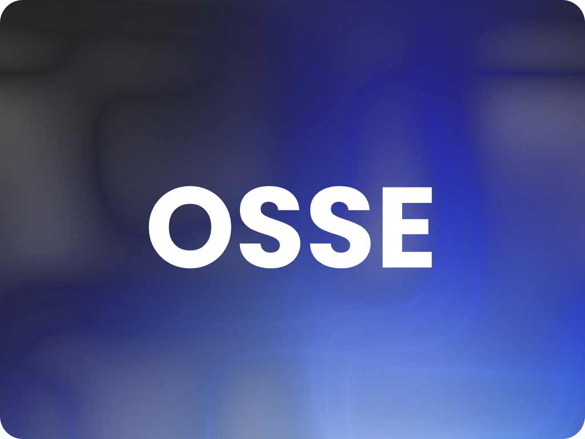

# Open-Source-Software-Engineering


Welcome to the **Open Source Software Engineering Degree** repository! This is a self-paced, community-driven program designed for aspiring software engineers who want to build a solid foundation in programming, computer science, and modern software development practices.

This project aims to provide an open-source curriculum that covers everything from basic coding principles to advanced topics like algorithms, systems design, and real-world project management.

---

## 📜 Why This Program?

The world of software development is constantly evolving, and formal education can be inaccessible to many. By creating a structured, open-source curriculum, we can empower learners across the globe to gain the skills needed to work as a software engineer in today’s industry — all for free!

---

## 🎯 Learning Outcomes

By the end of this program, you will:

- Have a deep understanding of core computer science concepts (data structures, algorithms, operating systems, etc.)
- Be proficient in at least one programming language (e.g., Python, Java, C++)
- Have hands-on experience with software version control (Git), debugging, and testing
- Understand software development methodologies (Agile, Scrum, etc.)
- Be able to design, implement, and document scalable software systems
- Have built a portfolio of personal projects and contributions to open-source software

---

## 🗂 Curriculum Structure

The curriculum is divided into modules, which are structured to gradually build your knowledge. Each module includes tutorials, projects, and reading materials.

### 1. **Introduction to Programming**
   - **Languages**: Python, JavaScript, or C++
   - **Concepts**: Variables, control structures, loops, functions, basic data types
   - **Projects**: Basic calculators, simple games, etc.

### 2. **Computer Science Fundamentals**
   - **Concepts**: Data structures (arrays, lists, stacks, queues), algorithms (sorting, searching)
   - **Projects**: Implement basic data structures, searching/sorting algorithms
   - **Resources**: 
     - [Introduction to Algorithms](https://mitpress.mit.edu/books/introduction-algorithms)
     - [Harvard CS50](https://cs50.harvard.edu/)

### 3. **Version Control & Collaboration**
   - **Tools**: Git, GitHub
   - **Concepts**: Branching, merging, pull requests, issues, code review
   - **Projects**: Contribute to an open-source repository

### 4. **Object-Oriented Programming (OOP)**
   - **Languages**: Python, Java
   - **Concepts**: Classes, inheritance, polymorphism, encapsulation
   - **Projects**: Build a command-line to-do app, library management system

### 5. **Web Development**
   - **Languages**: HTML, CSS, JavaScript, Node.js
   - **Concepts**: Frontend vs. backend, RESTful APIs
   - **Projects**: Build a personal portfolio, blog platform

### 6. **Databases**
   - **Concepts**: SQL, NoSQL, database normalization, indexing
   - **Projects**: Design and implement a relational database for a small e-commerce site

### 7. **Systems Design**
   - **Concepts**: Scalable systems, load balancing, microservices, APIs
   - **Projects**: Design the architecture for a social media app

### 8. **Operating Systems**
   - **Concepts**: Process management, memory management, file systems
   - **Projects**: Implement a basic shell or file system in C

### 9. **Software Testing & Debugging**
   - **Concepts**: Unit tests, integration tests, debugging tools
   - **Projects**: Write test cases for an existing project, implement CI/CD

### 10. **Capstone Project**
   - Design, build, and deploy a full-scale application or contribute to a major open-source project.

---

## 🚀 Getting Started

### Prerequisites:
- Basic understanding of mathematics and logic.
- Familiarity with computers and using the command line is helpful but not required.
- An eagerness to learn!

### How to Use This Repository:
1. **Start from the beginning**: Go module by module in sequence. If you're a beginner, start with "Introduction to Programming."
2. **Set your own pace**: There is no deadline! This is self-paced learning.
3. **Hands-on practice**: Every module has practical projects — complete them and add them to your portfolio.
4. **Contribute**: As you progress, contribute to this repository by suggesting new resources, improving existing modules, or helping others via issues and pull requests.

---

## 🛠 Tools You’ll Need

- [VS Code](https://code.visualstudio.com/)
- [Git](https://git-scm.com/)
- [Docker](https://www.docker.com/)
- [Postman](https://www.postman.com/)
- [Slack](https://slack.com/) for communication

---

## 👥 Contributing

We welcome contributions from everyone! Here's how you can get involved:

1. **Fork this repository**: Click the Fork button at the top right of this page and make a copy of this repository to your own GitHub account.
2. **Clone the repository**: Clone your fork to your local machine using:
   ```bash
   git clone https://github.com/your-username/open-source-software-engineer-degree.git
